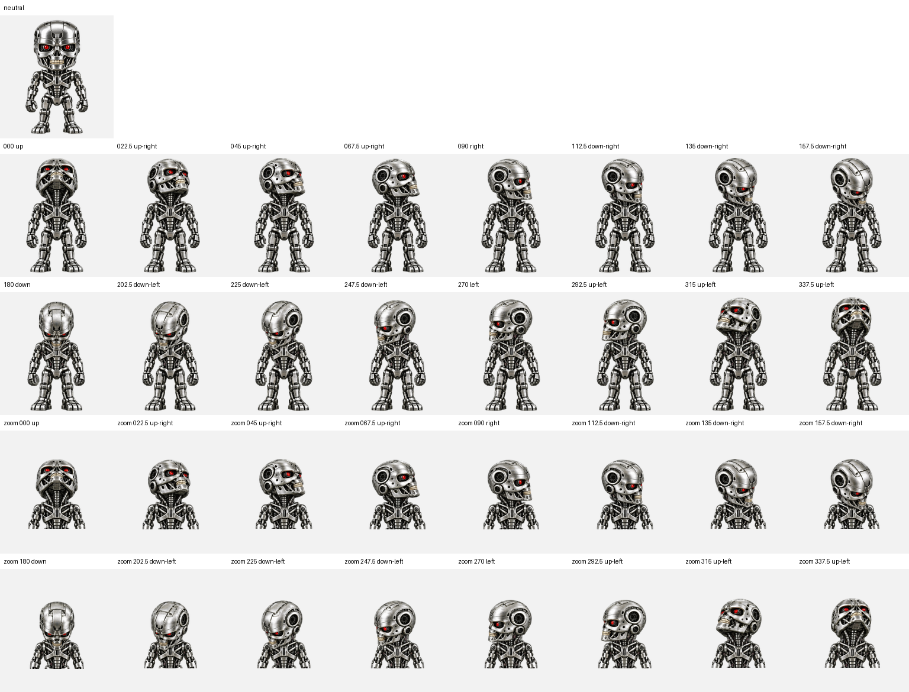
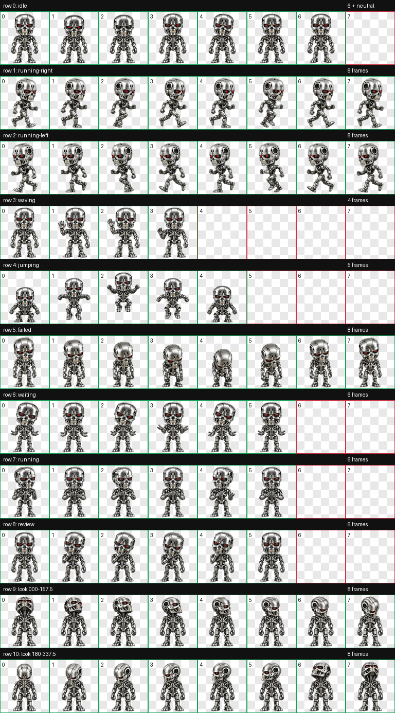

# PET-800

**Хромированный T-800 для ChatGPT / Codex Desktop**

Миниатюрный эндоскелет с красными оптическими сенсорами. Реагирует на работу, ожидание, ошибки и завершение задач.

[Скачать готовый ZIP](dist/PET-800.zip) · [Посмотреть все анимации](assets/contact-sheet.png)

## Возможности

- 9 анимаций: покой, бег вправо и влево, приветствие, прыжок, ошибка, ожидание, работа и просмотр результата.
- 16 направлений взгляда с поворотом металлической головы.
- Прозрачный атлас v2: **1536 × 2288**, ячейка **192 × 208**.

## Установка

1. [Скачайте ZIP](dist/PET-800.zip) и распакуйте его.
2. Скопируйте папку `t-800` целиком:
   - **Windows:** в `%USERPROFILE%\.codex\pets\`
   - **macOS / Linux:** в `~/.codex/pets/`
3. В настольном приложении откройте **Settings → Pets**, нажмите **Refresh** и выберите **T-800**. Команда `/pet` показывает питомца на рабочем столе.

Папка `t-800` содержит `pet.json` и `spritesheet.webp`. Файлы также лежат в корне этого репозитория для просмотра и повторной упаковки.

## Как он выглядит

Открыть все кадры анимации

## Совместимость

Этот пакет предназначен для настольного приложения ChatGPT / Codex. [Официальная документация о питомцах](https://learn.chatgpt.com/docs/pets) описывает выбор локального питомца через **Settings → Pets**. Веб-загрузка пользовательского атласа сейчас требует размер 1536 × 1872; у PET-800 формат v2 1536 × 2288.

Неофициальный фанатский проект. Не связан с правообладателями Terminator.
